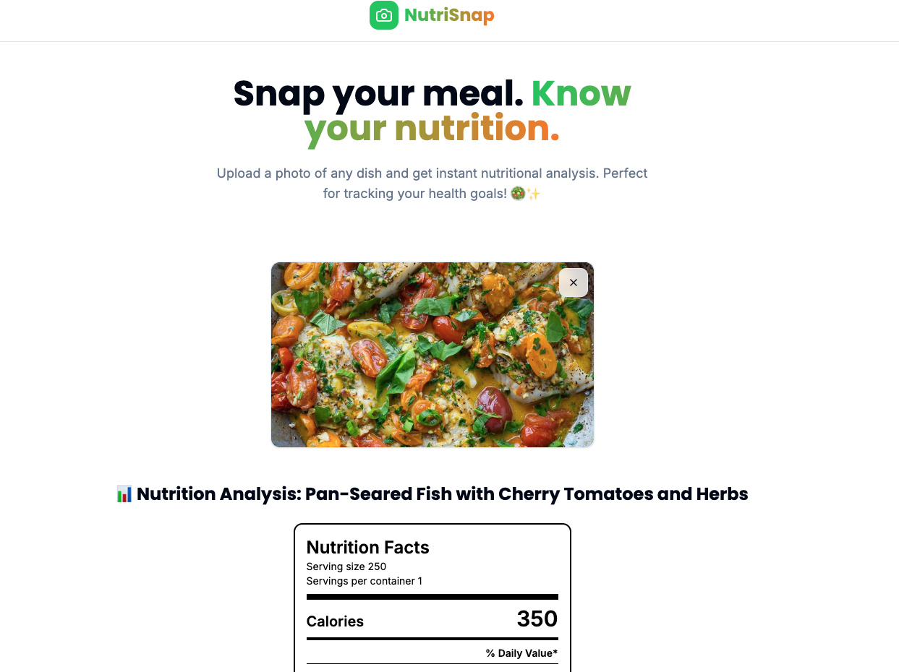
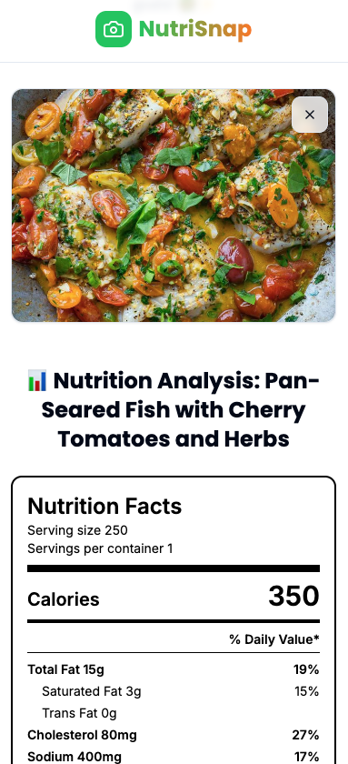

# MealSnap: AI-Powered Nutrition Facts Analyzer



MealSnap is an AI-powered web application that analyzes food images to provide detailed nutritional information. Simply upload a photo of your meal, and the app will identify the food and generate a comprehensive nutrition label in FDA format.

## Features

- **Image Analysis**: Upload photos of food dishes for instant nutritional analysis
- **AI-Powered Recognition**: Utilizes OpenAI's GPT-4o model for accurate food identification
- **Detailed Nutrition Facts**: Displays comprehensive nutritional information in FDA-style format
- **User-Friendly Interface**: Modern, responsive design with intuitive controls
- **Real-Time Processing**: Quick analysis with visual feedback during processing



## Tech Stack

MealSnap is built with modern web technologies:

### Frontend
- **React 18**: For building the user interface with functional components and hooks
- **TypeScript**: For type-safe code and improved developer experience
- **Vite**: For fast development and optimized production builds
- **Tailwind CSS**: For utility-first styling and responsive design
- **shadcn/ui**: For beautiful, accessible UI components

### AI & Data Processing
- **OpenAI API**: Utilizing GPT-4o for image analysis and nutritional data extraction
- **Base64 Encoding**: For efficient image data transfer to the AI model

### State Management
- **React Hooks**: useState and useEffect for local state management

### Development Tools
- **ESLint**: For code quality and consistency
- **TypeScript**: For static type checking
- **npm/Yarn**: For package management

## Installation & Setup

### Prerequisites
- Node.js (v16 or higher)
- npm or Yarn
- OpenAI API key

### Installation Steps

1. **Clone the repository**
   ```sh
   git clone https://github.com/yourusername/meal-snap-nutrition-facts.git
   cd meal-snap-nutrition-facts
   ```

2. **Install dependencies**
   ```sh
   npm install
   # or
   yarn
   ```

3. **Set up environment variables**
   
   Create a `.env` file in the root directory with your OpenAI API key:
   ```
   VITE_OPENAI_API_KEY=your_openai_api_key_here
   ```

4. **Start the development server**
   ```sh
   npm run dev
   # or
   yarn dev
   ```

5. **Open your browser**
   
   Navigate to `http://localhost:5173` to see the application running.

## Usage

1. Click the upload button or drag and drop a food image
2. Wait for the AI to analyze the image (typically a few seconds)
3. View the detailed nutrition facts label for your food
4. Use the information to make informed dietary choices

## Project Structure

```
/src
  /assests        - Images and static assets
  /components     - Reusable UI components
  /config         - Configuration files for OpenAI and image processing
  /hooks          - Custom React hooks
  /lib            - Utility functions and shared code
  /pages          - Main application pages
  App.tsx         - Main application component
  main.tsx        - Application entry point
```

## Contributing

Contributions are welcome! Please feel free to submit a Pull Request.

## License

This project is licensed under the MIT License - see the LICENSE file for details.

## Acknowledgements

- OpenAI for providing the powerful vision models
- The React and TypeScript communities for excellent documentation and tools
